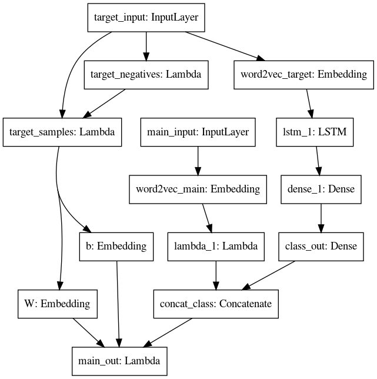

#  Word2Vector  
基于CBOW、skip-gram、词-文档矩阵、词-词矩阵四种方法的词向量生成。
# 项目介绍  
本项目主要实现1）基于矩阵的分布式表示和3）基于神经网络的分布表示两种方法。其中1）包括词-文档共现矩阵，词-词共现矩阵两种 ，2）包括cbow和skipgram两种模型。  
# 训练过程
一、输入语料：  
1、经过分词的新闻文本共1W篇，约30M，详见data/data.txt  
2、使用词-文档共现方法构建词向量，详见word2doc.py  
3、使用词-词共现方法构建词向量，详见word2word.py  
4、使用cbow方法构建词向量，详见cbow.py,keras_cbow.py 
5、使用skip-gram方法构建词向量，详见skipgram.py  
二、参数设置：  
1、window_size:上下文窗口，默认设置为5，即前后5个词，这个在词-词共现以及cbow,skipgram中会用到  
2、min_count:词语最低频次阈值，减少计算量，忽略稀有词，设定阈值。  
3、embedding_size:生成的词向量维度，默认设置为200  
三、模型保存  
模型保存在model当中 

# 结果
```
品读, [('文理', 0.62380444614519), ('被动', 0.6131815777568849), ('容量', 0.6118427256026242), ('高升', 0.6046968278219469), ('妈们', 0.6037820896343098), ('懂得', 0.6036901087166944), ('涂鸦', 0.6028254969327469), ('带来', 0.6024739186493533), ('聚焦', 0.6012434289187397), ('威胁', 0.6010902865695144)]
假条, [('花卷', 0.6406688396827188), ('生肖', 0.6303507323446187), ('猩红热', 0.6213240707709078), ('走进', 0.6197936354675044), ('正确看待', 0.6190089005579666), ('试用', 0.6165085556684461), ('身体', 0.615800038446009), ('桌子', 0.6130971060622841), ('退款', 0.6128791973607758), ('大王', 0.6123687799710491)]
解答, [('坐火车', 0.6365634770644051), ('边写', 0.6314200527426684), ('探讨', 0.626327157876045), ('请示', 0.6226703898976402), ('教研员', 0.6222663724106795), ('自接', 0.6215506116683587), ('静下心来', 0.621048011335986), ('晚八点', 0.6151277662090162), ('此项工作', 0.6138627012159895), ('乐清', 0.6135965346805461)]
炒鸡蛋, [('凭卡', 0.6347151034253893), ('点滴', 0.6309728064958572), ('放大镜', 0.6304410754381018), ('潍坊市', 0.6247911434637219), ('奖学金', 0.6247662186050053), ('一写', 0.6238588510709192), ('杠杆', 0.6200588027069978), ('招募', 0.6198784258992411), ('打工', 0.6114314829141203), ('餐后', 0.6090907382080412)]
```
# 总结  
1、基于共现矩阵分解的词向量构建方法对硬件要求较高，会随着词数和文档数量迅速增加  
2、虽然word2word采用的是1k的语料，是woed2doc的十分之一，但从效果上来看，还行，说明word2word的方法与word2doc相比...?  
3、从当前结果上来看，小语料当中基于矩阵的分布式表示效果要好于基于神经网络的分布表示  
4、从cbow和skipgram的效果看来，cbow在小语料当中表现要更好  
5、算法还有许多不足，需要继续改进,比如训练引入实体识别或者把共现矩阵的特征引入到skipgram的方案中

<font color='red'> *升级了cbow使其融合了实体识别的信息，embdding中，包含了文本的实体信息。* </font>


# 成果展示
```
打卡, [('电子', 0.6133376941100505), ('即可', 0.6093198752352431), ('改成', 0.5915801406331141), 
('第二台', 0.5901279079163829), ('刷屏', 0.5854355979301431), ('通讯录', 0.5790128443419728), 
('修改', 0.5778715220101476), ('oppo', 0.5770180802588569), ('绑定', 0.5764645780443222), ('未找到', 0.5758474662020164)]
```
*发现打卡之中有个非常规关键词，‘未找到’，经原因分析，由于‘打卡’改成‘习惯养成’了，此成果有助于后续bug分析。*